# S-Company Customer Experience & Innovation Centre 🧪✨

> **Architectural Concept Visualization & Digital Interactive Showcase**  
> *Where Flavor, Color & Sensory Science Converge.*

---

## 🌐 Live Website
Explore the interactive 3D floor plan and high-resolution interior renders:  
👉 **[https://neha-bagri.github.io/sensient-experience-centre/](https://neha-bagri.github.io/sensient-experience-centre/)**

---

## 🏛️ Executive Summary

The **S-Company Customer Experience & Innovation Centre** is an architectural concept designed to unite **Flavor, Color, Sensory Science, Application Development, and Co-Creation** into a seamless, hospitality-driven customer journey. 

Rather than a conventional sterile laboratory, the centre blends high-end Scandinavian warmth, acoustic fluted timber, terrazzo bars, and living green walls with precision ISO sensory testing environments.

---

## 🗺️ Key Spatial Zones & Capacities

| Zone | Capacity / Scale | Key Architectural & Functional Highlights |
| :--- | :--- | :--- |
| **01. Entrance & Welcome** | Concierge Reception | Botanical living wall, "World of S-Company" illuminated welcome arch. |
| **02. Experience Gallery** | Central Pavilion | Full-spectrum rainbow color tunnel, 20+ backlit extract bell jars, interactive molecular pairing touch-tables. |
| **03. Executive Boardroom Suite** | **30 Participants** | Grand presentation table with 4K video wall, plus adjacent **15-person workshop room**. Flanked by a **central back-of-house sample kitchen** with silent pass-through hatches. |
| **04. Sensory Science Lab** | **20 Participants** | **10 ISO private testing booths** with color-coded accent panels and sliding sample hatches, plus an illuminated **10-seat curved tasting bar**. |
| **05. Demo Kitchen & Application Lab** | Commercial Demo Scale | Stainless steel cooking islands, beverage formulation bar with taps, bakery & confectionery prototype stations. |
| **06. Color Playground & Chemistry** | Blending Stations | Natural shade matching, light cabinets, and thermal/light stability testing benches. |
| **07. Co-Creation Workshop** | 12–16 Collaborators | Custom oak collaboration workbench, interactive digital formula smartboards, and dropper extract libraries. |
| **08. Trend Lounge & Experience Café** | Degustation Lounge | Luxury terrazzo espresso bar, craft draft taps, botanical living wall, and prototype tasting seating. |

---

## 🔄 10-Step Seamless Customer Journey

```mermaid
flowchart LR
    A[01. Arrival & Welcome] --> B[02. Experience Gallery]
    B --> C[03. 30p Boardroom Pitch]
    C --> D[04. 20p Sensory Lab]
    D --> E[05. Demo Kitchen Formulation]
    E --> F[06. Color Playground]
    F --> G[07. Co-Creation Studio]
    G --> H[08. Trend Lounge]
    H --> I[09. Experience Café]
    I --> J[10. Actionable Roadmap]
```

---

## ⚙️ Architectural & Operational Logic

1. **Discreet Central Sample Flow**:  
   The dedicated sample prep kitchen is nestled directly between the 30-person boardroom and the breakout workshop room. Technicians can slide temperature-sensitive samples onto serving credenzas without entering or interrupting presentations.
2. **Dual-Mode Sensory Testing (20p Total)**:  
   Combines 10 blind ISO-standard testing booths with hatch delivery for rigorous scientific data collection and an open 10-person circular bar for collaborative degustation.
3. **Hospitality Meets Science**:  
   High-end natural materials (oak, terrazzo, brass, glass) create a welcoming executive client experience.

---

## 💻 Tech Stack & Deployment

- **Frontend**: HTML5, Tailwind CSS, Vanilla JavaScript, FontAwesome
- **AI Visuals**: Gemini AI & Imagen 3 Architectural Rendering Engine
- **Hosting**: GitHub Pages (Static Web Hosting)
- **Repository**: [https://github.com/Neha-Bagri/sensient-experience-centre](https://github.com/Neha-Bagri/sensient-experience-centre)

---

## 👤 Author & Credits
- **Project Lead**: Neha Bagri
- **Concept**: S-Company Customer Experience & Innovation Centre
